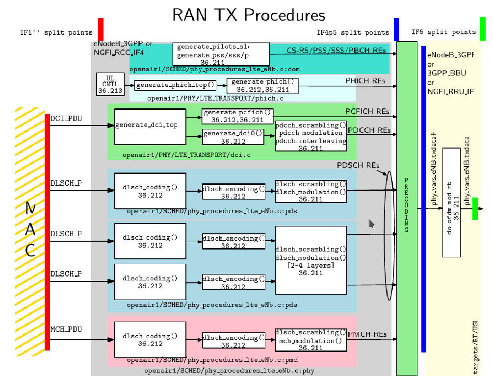

# Important Notes:

* This expects to be a comprehensive walkthrought over the PHY layer implementation of OpenAirInterface project, it assumes the basic LTE protocol concepts are known.
* Although the OpenAirInterface have several applications, this study focus on the LTE eNodeB.
* Get more information at [openairinterface5g](https://gitlab.eurecom.fr/oai/openairinterface5g) project

## Contribute:
* The code moves fast, any error or wrong information, please contribute.

# OpenAirInterface 5G Code Study

## Downlink Building Blocks

## eNodeB Application (v0.6)
- [Where the eNB application starts?](v0.6/lte_softmodem.md)
- [The Common Signals (PSS/SSS/Pilots)](v0.6/common_sig.md)
- [The PDCCH/PCFICH processing](v0.6/pdcch.md)
- [The PDSCH processing](v0.6/pdsch.md)
- [The PBCH processing](v0.6/pbch.md)
- The PHICH processing
- The OFDM Modulation

## UE Application (v0.6)
- [Where the UE application starts?](ue_v0.6/lte_softmode.md)

## OAI Code v0.5.2

- [The RF Frontend](v0.5.2/rf_frontend.md)
- [The eNodeB Process](v0.5.2/enodeb_process.md)
- [OFDM Modulation Process](v0.5.2/dl_ofdm_modulation.md)
- [Uplink Decodification (TODO)](v0.5.2/uplink-decoding.md)
